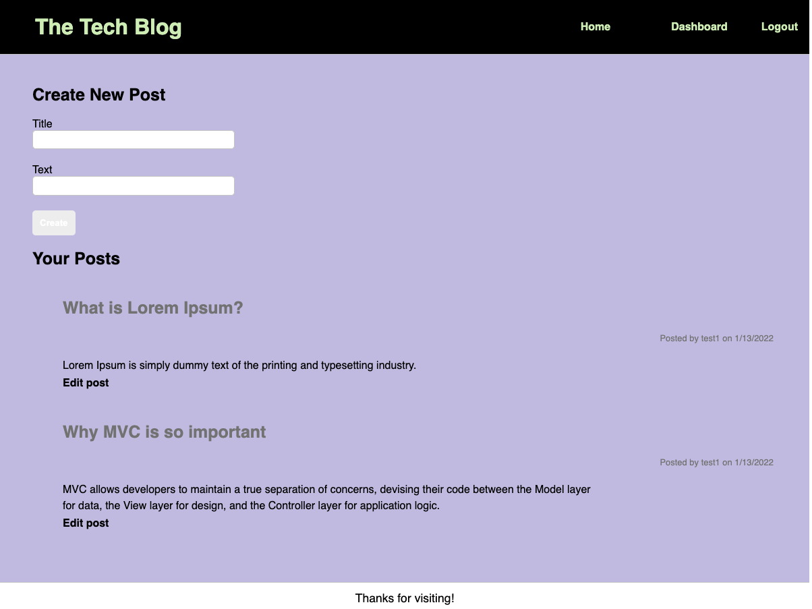

# Tech Blog
## Purpose
A tech blog that allows users to sign up, login, and logout. 
Users can write posts about their tech thoughts, and comment on the tech thoughts of other users.

## Installation
Download the application and run:
```
npm i
npm i sequelize
npm i dotenv
npm install --save mysql2

```

## Deployed Application
https://new-tech-blog1.herokuapp.com/

## Github Repo
https://github.com/dan13l80/Tech-Blog

## Screenshot
Sample scheenshot:


